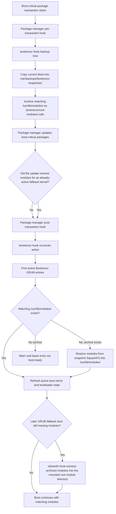

# bootrecov

<p align="center">
  
</p>

`bootrecov` is a Linux-only CLI and TUI for creating inspectable `/boot` recovery snapshots and exposing selected snapshots as bootloader fallback entries.

It is aimed at Linux EFI systems where you want a simple recovery path for kernel, initramfs, microcode, and bootloader state without doing a full root filesystem rollback. GRUB is the currently supported bootloader backend; Arch and Fedora-family systems have package-manager hook support, with Ubuntu/Debian detection and GRUB layout support available.

## No Warranty / Own Risk

Bootrecov touches boot-critical files and can make a system unbootable. It is provided without warranty, and you use it entirely at your own risk.

Every TUI or CLI invocation requires an explicit acknowledgement. Interactive runs ask for a `y/N` confirmation in a bordered prompt. Non-interactive automation must pass `--yes-i-understand` or set `BOOTRECOV_ACCEPT_RISK=1` for that invocation.

## What It Can Do

- Create timestamped snapshots of `/boot`.
- Store snapshots under `/var/backups/bootrecov-snapshots/<name>`.
- Optionally mirror selected snapshots into an active boot mirror for booting. The default is `/boot/efi/bootrecov-snapshots/<name>`; Fedora/BLS layouts use `/boot/bootrecov-snapshots/<name>` when BLS entries are present and no explicit override is set.
- Detect the current Linux platform and bootloader with explicit override support.
- Generate Bootrecov GRUB entries in `/etc/grub.d/41_bootrecov_snapshots`.
- Generate Bootrecov BLS entries on Fedora-family GRUB/BLS systems when the snapshot mirror is on the same boot filesystem.
- Regenerate `/boot/grub/grub.cfg` after GRUB entry changes.
- Activate and deactivate recovery entries from the CLI or TUI.
- Reconcile active boot mirrors and bootloader entries against the snapshot store.
- Remove stale inactive boot mirrors.
- Preserve an already bootable GRUB entry if refreshing its active boot mirror fails transiently.
- Print GRUB recovery commands for an activated snapshot.
- Install Arch pacman hooks to create snapshots before boot-critical package changes and refresh active recovery entries after them.
- Install an Arch/mkinitcpio boot-time restore hook so selected GRUB fallbacks can restore missing archived modules automatically after root mount.
- Install Fedora DNF action hooks and a dracut boot-time restore module for Fedora-family GRUB systems.
- Archive the matching `/usr/lib/modules/<kernel-version>` tree as compressed SquashFS metadata inside the snapshot source.
- Restore archived `/usr/lib/modules/<kernel-version>` trees automatically during activation when the live tree is missing.
- Clean up module trees restored by Bootrecov after their last recovery entry is removed, when no installed or running kernel needs them.
- Validate snapshot names before path-sensitive operations.
- Verify the configured boot mirror root before activation or reconcile mutates boot state, so it does not silently write into an unmounted `/boot/efi` or `/boot` directory.
- Report detected platform, bootloader, paths, and support status with `bootrecov doctor`.

## What It Does Not Do

- It does not overwrite an existing `/usr/lib/modules/<kernel-version>` tree.
- It does not mount the archived SquashFS module image during boot.
- It does not repair a broken root filesystem.
- It does not detect failed boots automatically.
- It does not prune old snapshots automatically yet.
- It does not install apt/dpkg hooks yet.
- It does not install initramfs-tools boot-time restore hooks yet.
- It detects `systemd-boot`, but does not manage systemd-boot entries yet.
- It is not a replacement for a rescue USB or real system backups.

The archived module SquashFS makes the backup complete and restorable. Activation stays conservative: if the matching `/usr/lib/modules/<version>` tree already exists, Bootrecov leaves it alone; if it is missing and the snapshot has an archive, Bootrecov restores that exact tree before adding the bootloader entry.

Restored module trees carry an ownership marker. On Arch, deactivation, backup deletion, entry removal, and reconciliation can remove a marked tree after its last recovery entry is gone. Cleanup keeps the running kernel, package-owned files, and trees referenced by remaining GRUB or BLS entries, including manually maintained entries. Bootrecov serializes these operations across processes and holds the Arch package lock while cleaning. Other distributions retain marked trees until package-safe cleanup is supported. Cleanup waits until after an active package transaction and runs on the next removal or reconciliation. Older, unmarked directories are left for manual inspection.

Cleanup does not execute GRUB scripts. It retains modules when a selected boot device or configuration reference cannot be proved from the mounted filesystems, or when a script uses unsupported dynamic paths. `chainloader` entries, including Windows dual-boot entries, and `search --file` also defer cleanup. A completed removal or reconciliation is reported separately from any subsequent module-cleanup warning.

## Storage Model

Bootrecov keeps two locations with different purposes:

- Snapshot source: `/var/backups/bootrecov-snapshots/<name>`
- Active boot mirror: usually `/boot/efi/bootrecov-snapshots/<name>`, or `/boot/bootrecov-snapshots/<name>` on Fedora/BLS layouts

New snapshots are written only to the snapshot source. Active boot mirrors are created only when a snapshot is activated for booting.

Module archives are stored only in the snapshot source:

```text
/var/backups/bootrecov-snapshots/<name>/.bootrecov/root-modules/<kernel-version>.sqfs
```

The internal `.bootrecov` metadata is intentionally excluded from active boot mirrors so small boot or EFI partitions do not get filled with root filesystem module trees.

## Requirements

Runtime:

- Linux
- GRUB for boot entry management
- EFI system partition mounted at the expected location
- `rclone`
- `grub-mkconfig`
- `mksquashfs` and `unsquashfs` from `squashfs-tools`
- `file` on Arch for identifying primary kernel versions during restored module cleanup
- `dracut` on Fedora-family systems when installing hooks
- DNF action plugin support on Fedora-family systems when installing hooks:
  - DNF5: `libdnf5-plugin-actions`
  - DNF4: `python3-dnf-plugin-pre-transaction-actions` and `python3-dnf-plugin-post-transaction-actions`

Build:

- Go `1.25+`

Normal operation usually requires root because Bootrecov writes to:

- `/var/backups/bootrecov-snapshots`
- `/boot/efi/bootrecov-snapshots`
- `/boot/bootrecov-snapshots` on Fedora/BLS systems
- `/etc/grub.d/41_bootrecov_snapshots`
- `/boot/grub/grub.cfg`
- `/etc/pacman.d/hooks/95-bootrecov-pre-transaction.hook`
- `/etc/pacman.d/hooks/96-bootrecov-post-transaction.hook`
- `/usr/lib/initcpio/install/bootrecov`
- `/usr/lib/initcpio/hooks/bootrecov`
- `/etc/mkinitcpio.conf`
- `/boot/loader/entries/bootrecov-*.conf` on Fedora/BLS systems
- `/etc/dnf/libdnf5-plugins/actions.d/95-bootrecov.actions`
- `/etc/dnf/plugins/pre-transaction-actions.d/95-bootrecov.action`
- `/etc/dnf/plugins/post-transaction-actions.d/95-bootrecov.action`
- `/usr/lib/dracut/modules.d/95bootrecov`

## Support Matrix

### Distribution Support

| Distribution / platform | Status | Package hook |
| --- | --- | --- |
| Arch Linux | Supported for Linux + EFI + GRUB systems | pacman hook supported |
| Arch-based distributions | Expected to work when their `/etc/os-release` and GRUB/EFI layout match Arch conventions | pacman hook supported when pacman hook paths are present |
| Fedora / RHEL-family | Supported for Linux + EFI + GRUB systems; BLS entries are preferred when usable | DNF5/DNF4 action hooks and dracut restore hook supported |
| Ubuntu | GRUB + EFI gate available with `make test-bootvm-ubuntu-grub` | apt/dpkg hook planned, not implemented |
| Debian | GRUB + EFI gate available with `make test-bootvm-debian-grub` | apt/dpkg hook planned, not implemented |
| Other Linux distributions | Experimental via detection and environment overrides | not implemented |

### Bootloader Support

| Bootloader | Status |
| --- | --- |
| GRUB | Supported backend |
| systemd-boot | Detected, but not managed yet |
| rEFInd | Not supported yet |
| Limine | Not supported yet |
| UKI-only / EFI stub | Not supported yet |
| Syslinux / extlinux | Not supported yet |
| U-Boot | Not supported yet |

Runtime detection uses `/etc/os-release`, mount information from `/proc/self/mountinfo`, visible boot artifacts, and existing bootloader files. Bootrecov can detect common layouts such as `/boot/efi`, `/efi`, and ESP-at-`/boot`; explicit overrides still win for unusual systems or tests:

```bash
BOOTRECOV_PLATFORM=ubuntu
BOOTRECOV_BOOTLOADER=grub
BOOTRECOV_BOOT_DIR=/boot
BOOTRECOV_ESP_DIR=/boot/efi
BOOTRECOV_EFI_MIRROR_DIR=/boot/efi/bootrecov-snapshots
BOOTRECOV_ROOT_MODULES_DIR=/usr/lib/modules
BOOTRECOV_PACMAN_HOOK_PATH=/etc/pacman.d/hooks/95-bootrecov-pre-transaction.hook
BOOTRECOV_PACMAN_POST_HOOK_PATH=/etc/pacman.d/hooks/96-bootrecov-post-transaction.hook
BOOTRECOV_MKINITCPIO_CONF=/etc/mkinitcpio.conf
BOOTRECOV_MKINITCPIO_INSTALL_HOOK=/usr/lib/initcpio/install/bootrecov
BOOTRECOV_MKINITCPIO_RUNTIME_HOOK=/usr/lib/initcpio/hooks/bootrecov
BOOTRECOV_MKINITCPIO_BIN=mkinitcpio
BOOTRECOV_GRUB_MKCONFIG=grub-mkconfig
BOOTRECOV_BLS_ENTRIES_DIR=/boot/loader/entries
BOOTRECOV_DNF5_ACTIONS_PATH=/etc/dnf/libdnf5-plugins/actions.d/95-bootrecov.actions
BOOTRECOV_DNF4_PRE_ACTIONS_PATH=/etc/dnf/plugins/pre-transaction-actions.d/95-bootrecov.action
BOOTRECOV_DNF4_POST_ACTIONS_PATH=/etc/dnf/plugins/post-transaction-actions.d/95-bootrecov.action
BOOTRECOV_DRACUT_MODULE_DIR=/usr/lib/dracut/modules.d/95bootrecov
BOOTRECOV_DRACUT_BIN=dracut
```

For Arch/mkinitcpio, Bootrecov detects the `mkinitcpio` binary from `PATH`, the mkinitcpio config when it exists, and the first existing initcpio install/runtime hook directories. The paths above are defaults and override examples, not universal Linux paths. Unknown initramfs backends fail with an explicit unsupported-backend error instead of receiving Arch-specific files.

For Fedora-family systems, Bootrecov detects Fedora/RHEL-like `/etc/os-release` IDs, prefers BLS entries under `/boot/loader/entries`, and uses `/boot/bootrecov-snapshots` for active mirrors when BLS entries are present and no explicit mirror override is set. That keeps fallback kernel and initramfs files on the same boot filesystem as the BLS entries instead of filling a small ESP. Fedora uses `grub2-mkconfig` when GRUB config regeneration is needed.

If multiple bootloader signals are present, for example GRUB files and systemd-boot loader entries on the same ESP, Bootrecov reports an ambiguous bootloader in `doctor`. Select the intended backend explicitly with `BOOTRECOV_BOOTLOADER=grub` or `BOOTRECOV_BOOTLOADER=systemd-boot`.

The detailed expansion roadmap for future distributions and bootloaders lives in [`docs/roadmap/`](docs/roadmap/README.md).

## Install And Build

Arch / AUR:

```bash
yay -S bootrecov
sudo bootrecov doctor
sudo bootrecov hook install
sudo bootrecov
```

The AUR package installs the binary and runtime dependencies. `bootrecov hook install` is still explicit opt-in because it writes pacman hooks, mkinitcpio hook files, and updates `/etc/mkinitcpio.conf`.

Build locally:

```bash
git clone https://github.com/marang/bootrecov.git
cd bootrecov
make build
```

Run the TUI from source:

```bash
make run
```

Run the built binary:

```bash
sudo ./bin/bootrecov
```

For system use, install the binary somewhere stable, for example `/usr/bin/bootrecov`.

## Quick Start

Create a snapshot:

```bash
sudo bootrecov backup create
```

List snapshots:

```bash
sudo bootrecov backup list
```

Activate a snapshot as an EFI + bootloader fallback:

```bash
sudo bootrecov backup activate <snapshot-name>
```

List Bootrecov bootloader entries:

```bash
sudo bootrecov bootloader list
```

Deactivate a snapshot:

```bash
sudo bootrecov backup deactivate <snapshot-name>
```

Delete a snapshot and related artifacts:

```bash
sudo bootrecov backup delete <snapshot-name>
```

Reconcile stored snapshots, active boot mirrors, and bootloader entries:

```bash
sudo bootrecov reconcile
```

Inspect detected platform and bootloader state:

```bash
bootrecov doctor
```

## CLI Reference

Start the TUI:

```bash
bootrecov
bootrecov tui
```

Inspect runtime detection:

```bash
bootrecov doctor
```

Manage snapshots:

```bash
bootrecov backup list
bootrecov backup create
bootrecov backup activate <snapshot-name>
bootrecov backup deactivate <snapshot-name>
bootrecov backup delete <snapshot-name>
bootrecov backup recovery <snapshot-name>
```

Manage bootloader state:

```bash
bootrecov bootloader list
bootrecov bootloader activate <snapshot-name>
bootrecov bootloader deactivate <snapshot-name>
bootrecov bootloader recovery <snapshot-name>
bootrecov reconcile
```

`bootrecov grub list` is retained as a deprecated compatibility alias for `bootrecov bootloader list`.

Install the package-manager hook:

```bash
bootrecov hook install
bootrecov hook install /absolute/path/to/bootrecov
```

Remove the package-manager hook:

```bash
bootrecov hook uninstall
```

Hook installation is implemented for Arch/pacman+mkinitcpio and Fedora-family DNF+dracut systems. Ubuntu/Debian apt/dpkg hook support is planned but intentionally not enabled yet.

Compatibility aliases retained for existing automation:

```bash
bootrecov backup-now
bootrecov install-pacman-hook
bootrecov recovery-commands <snapshot-name>
```

`backup list` shows:

- `SNAPSHOT`: snapshot exists in `/var/backups/bootrecov-snapshots`
- `EFI`: active boot mirror exists. The column name is retained for CLI compatibility.
- `BOOTLOADER`: Bootrecov bootloader entry exists
- `BOOTABLE`: snapshot is complete, active, synced, and can boot without restoring archived modules first
- `RESTORABLE`: snapshot is complete, active, synced, and can restore archived modules during activation/reconcile
- `ROOT-MODULES`: `yes`, `missing`, `archived`, or `unknown`
- `KERNEL`: detected kernel version

## TUI Controls

Backups view:

- `b`: create snapshot
- `g`: toggle EFI + bootloader activation
- `s`: reconcile active boot mirrors and bootloader state
- `r`: show recovery commands for selected backup
- `p`: install package-manager hook
- `d`: delete selected backup, with confirmation
- `tab`: switch to bootloader entries
- `q`: quit

Bootloader entries view:

- `x`: remove selected bootloader entry
- `tab`: switch back to backups
- `q`: quit

## Backup Profiles

The backup profile is selected with `BOOTRECOV_BACKUP_PROFILE`.

Default full profile:

```bash
BOOTRECOV_BACKUP_PROFILE=full
```

Minimal profile:

```bash
BOOTRECOV_BACKUP_PROFILE=minimal
```

`full` copies the `/boot` tree while excluding the mounted ESP subtree such as `/boot/efi/**`, so firmware files are not duplicated into snapshots or active boot mirrors.

`minimal` includes:

- `vmlinuz*`
- `initrd.img*`
- `initramfs*.img`
- `intel-ucode.img`
- `amd-ucode.img`
- `grub/**`

Both profiles can archive the matching `/usr/lib/modules/<kernel-version>` tree into `.bootrecov/root-modules/` when the kernel version is known and the module tree exists.

## Activation Model

Activation performs these steps:

1. Validate the snapshot name.
2. Verify the snapshot has a kernel and initramfs.
3. Verify matching root modules if the kernel version is known, restoring them from the snapshot archive when the live tree is missing.
4. Verify that the configured boot mirror root is actually mounted.
5. Check available EFI space.
6. Copy the snapshot into the active boot mirror, usually `/boot/efi/bootrecov-snapshots/<name>` or `/boot/bootrecov-snapshots/<name>` on Fedora/BLS systems.
7. Add a Bootrecov bootloader entry. On Fedora/BLS systems this is a Bootrecov-owned BLS file when usable; otherwise it is a GRUB custom menu entry.
8. Regenerate GRUB config when the selected entry backend requires it.

Deactivation removes the bootloader entry, removes the active boot mirror, and regenerates the bootloader config when the backend requires it. It also checks whether Bootrecov can clean up a restored module tree that is no longer needed.

Reconcile is intentionally conservative:

- Active snapshots are refreshed into EFI.
- Inactive boot mirrors are removed.
- Stale bootloader entries are removed.
- Unneeded module trees restored by Bootrecov are cleaned up when their ownership and safety checks pass.
- Entries for known missing root module trees are treated as not boot-ready.
- A previously bootable entry is preserved if refreshing its active boot mirror fails transiently.

## Package Hooks

Install:

```bash
sudo bootrecov hook install
```

On Arch with mkinitcpio, `bootrecov hook install` installs pacman hooks and an initramfs restore hook:

```text
/etc/pacman.d/hooks/95-bootrecov-pre-transaction.hook
/etc/pacman.d/hooks/96-bootrecov-post-transaction.hook
/usr/lib/initcpio/install/bootrecov
/usr/lib/initcpio/hooks/bootrecov
```

The pacman hooks run:

```bash
/usr/bin/env BOOTRECOV_ACCEPT_RISK=1 bootrecov hook backup-now
/usr/bin/env BOOTRECOV_ACCEPT_RISK=1 bootrecov hook reconcile-active
```

Hook-created snapshots are stored only in `/var/backups/bootrecov-snapshots`; they are not automatically activated in EFI or the bootloader. If there is not enough space for a pre-transaction snapshot, the hook prints a warning and skips the snapshot so the package transaction is not blocked. Other pre-transaction errors still fail the hook.

After the transaction, the post hook reconciles active Bootrecov entries. This restores archived module trees for already-active fallback kernels if the package update removed `/usr/lib/modules/<old-version>`, then refreshes active boot mirrors and bootloader state. Post-transaction reconcile errors are printed as warnings and do not fail the completed package transaction.

The mkinitcpio runtime hook is a second safety net. During a Bootrecov GRUB fallback boot, it runs from the initramfs after the real root is mounted at `/new_root`. If `/new_root/usr/lib/modules/<fallback-version>` is missing, it extracts the snapshot's archived SquashFS module tree into that expected path before normal userspace starts. The root module directory comes from Bootrecov's detected/configured `RootModulesDir` and defaults to `/usr/lib/modules`. This hook is Arch/mkinitcpio-specific; Fedora uses the dracut module described below.

On Fedora-family systems, `bootrecov hook install` installs DNF action files when a supported action plugin directory exists and installs a dracut module:

```text
/etc/dnf/libdnf5-plugins/actions.d/95-bootrecov.actions
/etc/dnf/plugins/pre-transaction-actions.d/95-bootrecov.action
/etc/dnf/plugins/post-transaction-actions.d/95-bootrecov.action
/usr/lib/dracut/modules.d/95bootrecov/module-setup.sh
/usr/lib/dracut/modules.d/95bootrecov/bootrecov-restore.sh
```

DNF5 systems need `libdnf5-plugin-actions`. DNF4 systems need `python3-dnf-plugin-pre-transaction-actions` and `python3-dnf-plugin-post-transaction-actions`. When both plugin layouts exist, Bootrecov installs only the DNF5 action file to avoid duplicate transaction hooks. If no supported DNF action directory exists, hook installation fails clearly instead of creating inert files. The dracut hook runs during fallback boots after the real root is mounted at `/sysroot` and restores missing archived modules into `/sysroot/usr/lib/modules/<fallback-version>`. Fedora/BLS GRUB boots may not preserve Bootrecov's custom kernel marker, so the dracut hook also recognizes fallback boots from a `BOOT_IMAGE` path under `bootrecov-snapshots`.



The Arch package removal script removes both pacman hook files, Bootrecov's mkinitcpio hook files, the `bootrecov` token from `HOOKS=(...)`, and then regenerates initramfs images when `mkinitcpio` is available. Regeneration errors are printed as warnings so package removal is not blocked.

Arch pacman trigger targets:

- `linux*`
- `grub`
- `mkinitcpio`
- `systemd`

Fedora DNF action files are scoped to boot-critical package filters such as `kernel*`, `grub*`, `shim*`, `dracut*`, `systemd*`, and `microcode_ctl`. The action hooks intentionally call the same hidden `bootrecov hook backup-now` and `bootrecov hook reconcile-active` commands as Arch.

There is no automatic pruning yet, so watch disk usage if you enable the hook.

On Ubuntu/Debian, `bootrecov hook install` currently returns a clear "not implemented yet" error instead of installing an unsafe partial apt/dpkg hook.

## Recovery Commands

For an activated snapshot:

```bash
sudo bootrecov backup recovery <snapshot-name>
```

This prints backend-specific recovery commands. For the current GRUB backend, the output can be used manually from a GRUB prompt. The snapshot must already have an active boot mirror.

## Tests

Detailed testing notes are in [`TESTING.md`](TESTING.md).

Fast checks:

```bash
go test ./...
go vet ./...
```

Full local test target:

```bash
make test
```

`make test` runs:

- `go vet ./...`
- `go test ./...`
- `go test -race ./...`
- `go test -cover ./...`

## Rootless VM Integration Test

The maintained end-to-end test harness lives in [`test/bootvm/`](test/bootvm/).

Preflight:

```bash
make test-bootvm-requirements
```

Run once:

```bash
make test-bootvm
```

Explicit GRUB platform gates:

```bash
make test-bootvm-ubuntu-grub
make test-bootvm-debian-grub
make test-bootvm-fedora-grub-bls
make test-bootvm-grub-matrix
make test-bootvm-platform-matrix
```

Run with a tmux watch UI:

```bash
make test-bootvm-watch
```

The watch UI creates a `bootrecov-bootvm` tmux session:

- pane 0: main test runner
- pane 1: status, runner activity, run log, serial log tail
- pane 2: interactive QEMU serial console

Attach manually:

```bash
tmux attach -t bootrecov-bootvm
```

Host tools required by the harness:

- `qemu-system-x86_64`
- `qemu-img`
- OVMF / `edk2-ovmf`
- `ssh`
- `scp`
- `ssh-keygen`
- `curl`
- `socat`
- one of `cloud-localds` or `genisoimage`

Arch example:

```bash
sudo pacman -S --needed qemu-base edk2-ovmf openssh curl cloud-image-utils socat
```

The VM test currently verifies:

- dependency preflight
- expected platform and GRUB backend detection through `bootrecov doctor`
- unsupported apt/dpkg hook installation refusal on Ubuntu/Debian
- snapshot creation
- SquashFS module archive creation
- active boot mirror creation without leaking `.bootrecov` metadata
- active fallback module restoration through the package-manager post-transaction hook path
- old-kernel snapshot activation with archived module restoration when `/usr/lib/modules/<version>` is missing
- bootloader entry generation through the GRUB backend
- Fedora/BLS entry generation under `/boot/loader/entries` with Btrfs `/boot` path handling
- booting the Bootrecov GRUB entry
- booting the backup entry after corrupting the primary kernel

Runtime artifacts are written under `test/bootvm/work/`, including:

- `run.log`
- `status`
- `last_error`
- `serial.log`
- `ssh_port`

There is also a legacy privileged/container-based harness kept for reference:

- [`test/bootvm/boot_test_vm.sh`](test/bootvm/boot_test_vm.sh)
- [`docker-compose.yml`](docker-compose.yml)

## Packaging And Releases

User-visible changes are tracked in [`CHANGELOG.md`](CHANGELOG.md).

Release automation:

- [`.github/workflows/release.yml`](.github/workflows/release.yml)
- [`.goreleaser.yml`](.goreleaser.yml)

Release targets:

- Linux `amd64`
- Linux `arm64`

AUR packaging:

- [`PKGBUILD`](PKGBUILD)
- [`.github/workflows/aur.yml`](.github/workflows/aur.yml)

AUR runtime dependencies include:

- `rclone`
- `grub`
- `squashfs-tools`
- `file`

Required GitHub secret for AUR publishing:

- `AUR_PRIVATE_KEY`

Optional AUR publish identity overrides:

- `AUR_COMMIT_NAME`
- `AUR_COMMIT_EMAIL`

## Development Notes

Useful targets:

- `make build`: build `bin/bootrecov`
- `make run`: run the TUI
- `make fmt`: run `gofmt`
- `make test`: run vet, tests, race tests, and coverage
- `make test-bootvm`: run the rootless VM integration test
- `make test-bootvm-ubuntu-grub`: run the explicit Ubuntu + GRUB VM gate
- `make test-bootvm-debian-grub`: run the explicit Debian + GRUB VM gate
- `make test-bootvm-fedora-grub-bls`: run the explicit Fedora + GRUB/BLS VM gate
- `make test-bootvm-grub-matrix`: run both Ubuntu + GRUB and Debian + GRUB gates
- `make test-bootvm-platform-matrix`: run Ubuntu, Debian, and Fedora GRUB gates
- `make test-bootvm-watch`: run the VM test in tmux watch mode
- `make clean`: remove build artifacts

Main implementation:

- [`cmd/bootrecov/main.go`](cmd/bootrecov/main.go)
- [`internal/tui/backups.go`](internal/tui/backups.go)
- [`internal/tui/model.go`](internal/tui/model.go)

Roadmap and support planning:

- [`docs/roadmap/`](docs/roadmap/README.md)

## Caveats

The safety model is documented in [`SAFETY.md`](SAFETY.md).

- Bootrecov assumes Linux + EFI, with GRUB as the currently supported bootloader backend.
- The default GRUB config output is `/boot/grub/grub.cfg`, with detection for GRUB config under the detected boot directory.
- The default active boot mirror root is `/boot/efi/bootrecov-snapshots`, with detection for mounted ESP roots such as `/boot/efi`, `/efi`, or ESP-at-`/boot`. Fedora/BLS systems default to `/boot/bootrecov-snapshots` when BLS entries are present and no explicit mirror override is set.
- Activation refuses to proceed if the configured boot mirror root is not mounted.
- systemd-boot is detected but not managed yet.
- Bootrecov is still young software touching high-risk boot paths. Test the full loop in a VM or spare system before relying on it.
